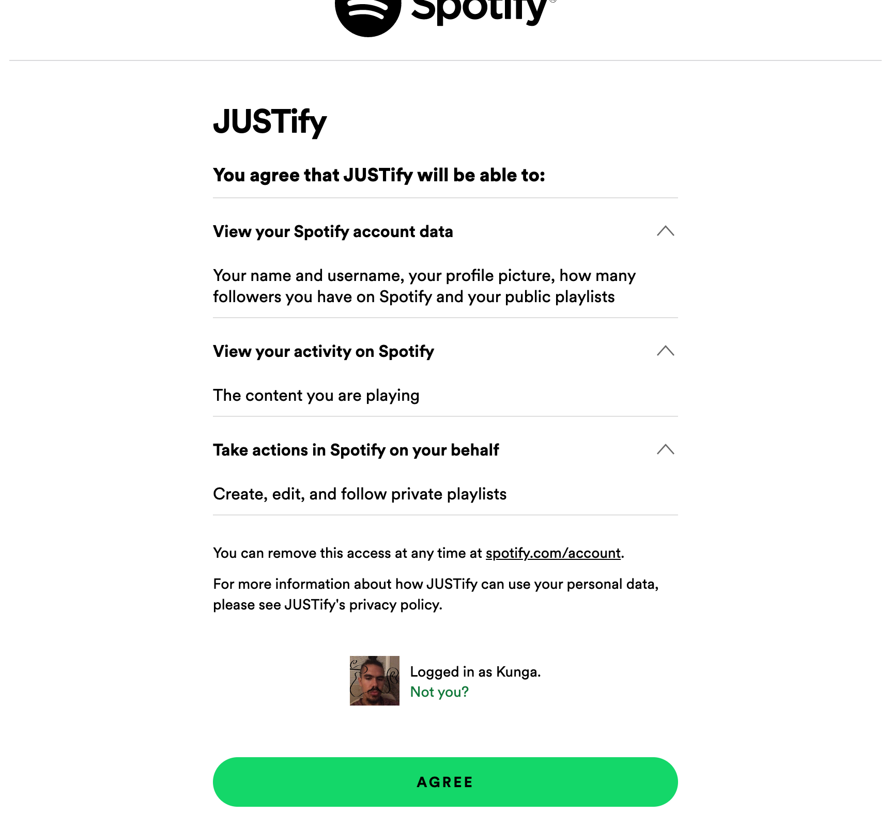
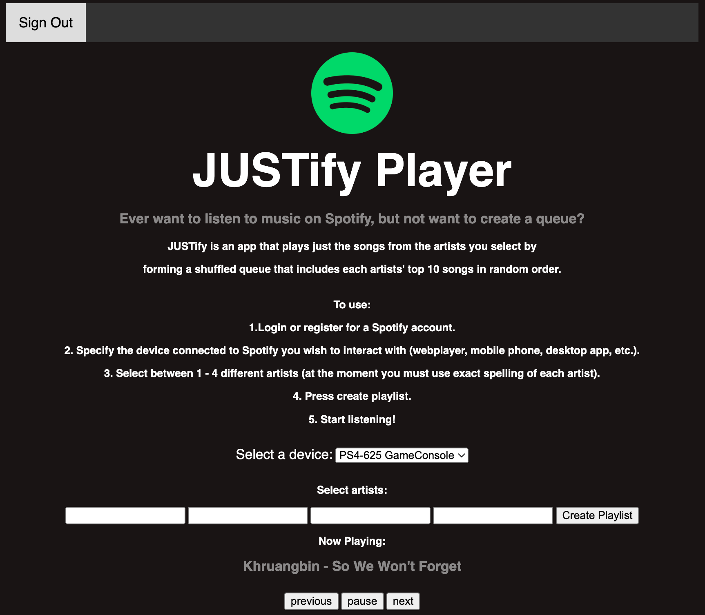

# JUSTify

Ever want to listen to music on Spotify, but not want 
to create a queue?

JUSTify is an app that plays just the songs from the 
artists you select by forming a shuffled queue that 
includes each artists' top 10 songs in random order.

## How To Use
(set environment variable: PYTHONUNBUFFERED=1;PORT=8082;SPOTIPY_CLIENT_ID=68e71e0a3b2344d4942c2449a217a59e;SPOTIPY_CLIENT_SECRET=8150ee0dfe834c079ad6b7ab9d8bbe61;SPOTIPY_REDIRECT_URI=http://127.0.0.1:8082/)
1. Login or register for a Spotify account.
2. Specify the device connected to Spotify you wish
to interact with (webplayer, mobile phone, 
desktop app, etc.).
3. Select between 1 - 4 different artists (at the moment
you must use exact spelling of each artist).
4. Press create playlist.
5. Start listening!

## Images of Use
Index

Spotify Login

Redirect to App

